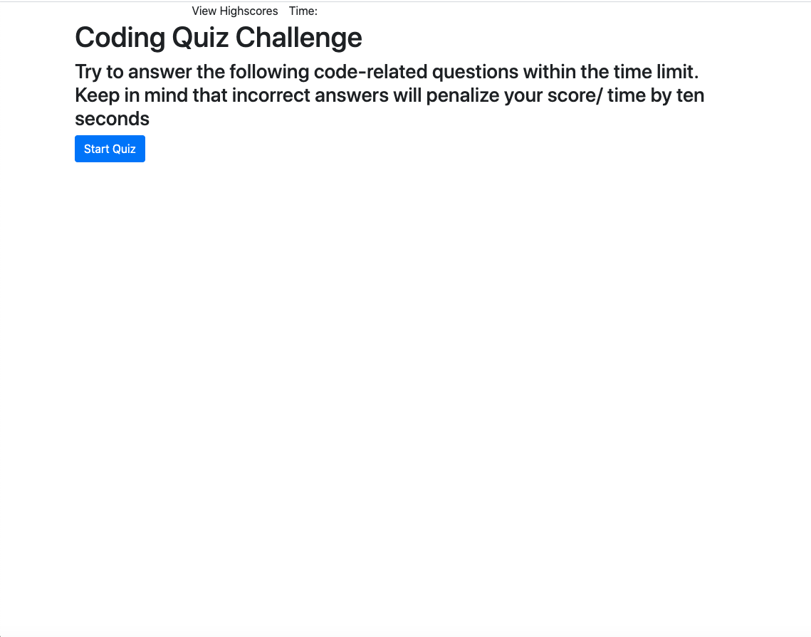
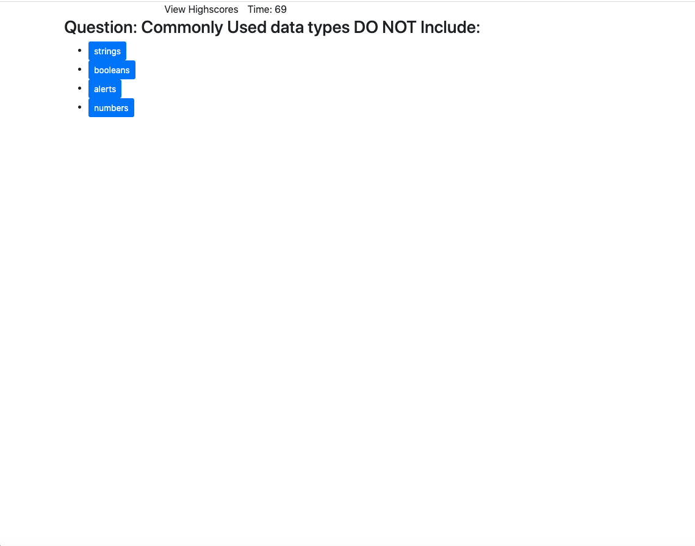

# gt-hw-web-apis-quiz

## Description 

This is a homework requirement for GT Full Stack Flex Program. This webpage is designed to start a countdown when you click start quiz. It will then show an array of questions, subtracting 10 seconds when you get an answer wrong and keeping the same time when you get an answer right. At the end, you will input your initials to end the quiz and receive your score (the remaining time!)

## Table of Contents

* [Installation](#installation)
* [Usage](#usage)
* [Credits](#credits)
* [MIT License](#mit_license)
* [Badges](#badges)
* [Contributing](#contributing)
* [Tests](#tests)

## Installation

1. Clone the repo
2. Open the index.html file

[Link to Code](#https://crystalwatkins.github.io/gt-hw-web-apis-quiz/.)
 
[Website link for My Portfolio Page](https://github.com/CrystalWatkins/gt-hw-web-apis-quiz)

## Usage 

This simple HTML file uses best practices for accessibility in programming.

[Link to Code](https://crystalwatkins.github.io/gt-hw-web-apis-quiz/).
 
[Website link for My Portfolio Page](https://github.com/CrystalWatkins/gt-hw-web-apis-quiz).

## Credits

This was an Quiz Web Page using API completed as a homework for the Georgia 
Tech, FullStack Flex Program.

## MIT_License

Copyright (c) [2020] [Crystal Watkins]

Permission is hereby granted, free of charge, to any person obtaining a copy
of this software and associated documentation files (the "Software"), to deal
in the Software without restriction, including without limitation the rights
to use, copy, modify, merge, publish, distribute, sublicense, and/or sell
copies of the Software, and to permit persons to whom the Software is
furnished to do so, subject to the following conditions:

The above copyright notice and this permission notice shall be included in all
copies or substantial portions of the Software.

THE SOFTWARE IS PROVIDED "AS IS", WITHOUT WARRANTY OF ANY KIND, EXPRESS OR
IMPLIED, INCLUDING BUT NOT LIMITED TO THE WARRANTIES OF MERCHANTABILITY,
FITNESS FOR A PARTICULAR PURPOSE AND NONINFRINGEMENT. IN NO EVENT SHALL THE
AUTHORS OR COPYRIGHT HOLDERS BE LIABLE FOR ANY CLAIM, DAMAGES OR OTHER
LIABILITY, WHETHER IN AN ACTION OF CONTRACT, TORT OR OTHERWISE, ARISING FROM,
OUT OF OR IN CONNECTION WITH THE SOFTWARE OR THE USE OR OTHER DEALINGS IN THE
SOFTWARE.

## Badges

## Contributing

Not currently taking any additional contributions at this time.

## Tests

There is no test needed for this project. 

